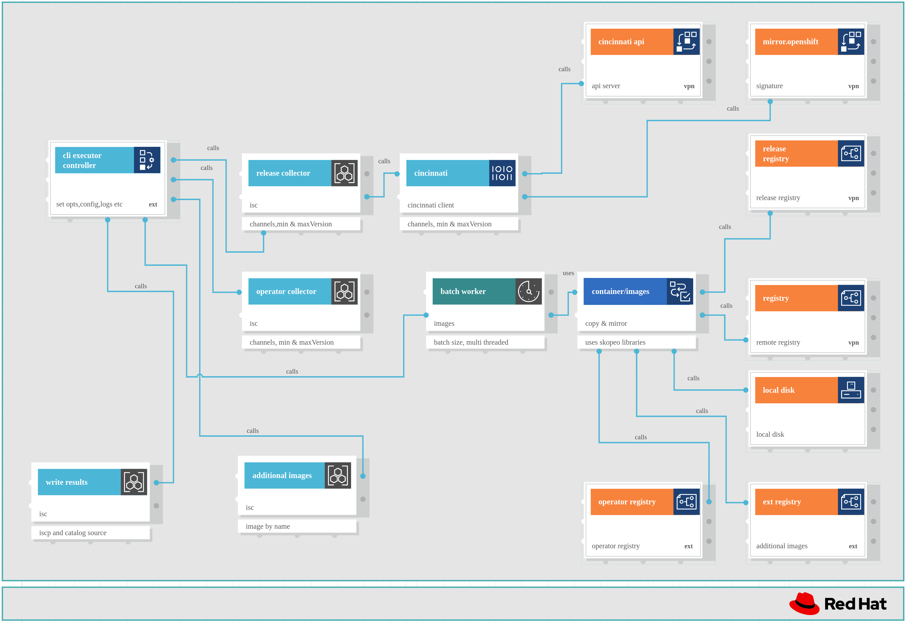

# Enclave Support

## What is enclave support?
[Enclave](https://en.wikipedia.org/wiki/Network_enclave): *The purpose of a network enclave is to limit internal access to a portion of a network. A major difference between a DMZ or demilitarized zone and a network enclave is a DMZ allows inbound and outbound traffic access, where firewall boundaries are traversed. In an enclave, firewall boundaries are not traversed.*

oc-mirror already focuses on mirroring content to disconnected environments for installing and upgrading OCP clusters.

This specific feature addresses use cases where mirroring is needed for several enclaves (disconnected environments), that are secured behind at least one intermediate disconnected network. 

In this context, enclave users are interested in:
* being able to **mirror content for several enclaves**, and centralizing it in a single internal registry. Some customers are interested in running security checks on the mirrored content, vetting it before allowing mirroring to downstream enclaves.
* being able to mirror contents **directly from the internal centralized registry** to enclaves without having to restart the mirroring from internet for each enclave
* **keeping the volume** of data transfered from one network stage to the other **to a strict minimum**, avoiding to transfer a blob or an image more than one time from one stage to another.

## When can I use the feature?
:warning: **The Enclave support feature is still an MVP and should not be used in production.**

In the 4.15 release, the enclave workflow is still an MVP (Minimal Viable Product). It will be graduating to Tech Preview in 4.16. 

After GA, this new mirroring technique is intended to replace the existing oc-mirror. 

To enable the enclave workflow, add `--v2` to the oc-mirror arguments passed at the command line.

Example:
```bash=
oc-mirror --v2 --help
```


The Enclave Support feature (`--v2`) has the **following limitations**:
* Mirroring **OCP releases only**. Operator catalogs, additional images and Helm charts are not yet supported.
* Mirroring to **fully disconnected clusters only**. In other words, mirroring to a registry  directly (Mirror-to-mirror) is not yet available.
  * Mirroring is only possible by: 
    * Generating an archive for the mirroring content described in the image set config (Mirror-to-disk)
      ```bash
      oc-mirror --v2 -c imageset_config.yaml file:///home/user/mirror_content
      ```
    * Mirroring from the archive to the disconnected registry (disk-to-mirror)
      ```bash
      oc-mirror --v2 -c imageset_config.yaml --from file:///home/user/mirror_content docker://disconnected_registry.internal:5000/
      ```


## Reference Architecture Diagram for Enclave Support


## How to mirror to an enclave? 

The following diagram will be used to illustrate the workflow for mirroring to enclaves, with an intermediate disconnected network stage, called airgap env in the diagram.


### Overall diagram


### Phase 1 - Mirroring to the airgap env(on-premise registry)
The goal of this phase is to transfer the images needed by one or several enclaves into the enterprise's central registry.

The central registry (entrerpise-registry.in in the diagram) is usually in a secure network (airgap env in the diagram), not directly connected to the public internet.

:bell: The steps depicted in Phase 1 match exactly the steps for mirroring to a disconnected environment. 

#### Step1 - Generating a mirror archive


The end-user will execute oc-mirror in an environment with access to the public internet. This is illustrated as arrow 1 in the diagram. 

```bash=
oc-mirror--v2 -c isc.yaml file:///home/user/enterprise-content
```
This action collects all the OCP content into an archive and generates an archive on disk (under /home/user/enterprise-content in the diagram).

Example of isc.yaml:
```yaml=
apiVersion: mirror.openshift.io/v1alpha2
kind: ImageSetConfiguration
# storageConfig: 
# The storageConfig section is no longer relevant for the enclave support feature. If added, it will be ignored
mirror:
  platform:
    architectures:
      - "amd64"
    channels:
      - name: stable-4.15
        minVersion: 4.15.0
        maxVersion: 4.15.3
```

#### Step2 - Archive transfer to the air gap env
Once the archive generated, it will be transfered to the airgap env. This is illustrated as arrow2 in the diagram. The transport mechanism is not part of oc-mirror, and depends on the strategies set up by the enterprise's network administrators.

In some cases, the transfer is done manually: the disk is physically unplugged from one location, and plugged to another computer in the airgap env. In other cases, SFTP or other protocols may be used.

#### Step3 - Mirroring contents into the (on-premise) airgap env registry

Once the transfer of the archive generated in Step1 is done (to /disk1/enterprise-content in the diagram), the user can execute oc-mirror again in order to mirror the relevant archive contents to the registry (entrerpise-registry.in in the diagram). This is illustrated by arrow 3 in the diagram.

```bash=
oc-mirror --v2 -c isc.yaml --from file:///disk1/enterprise-content docker://enterprise-registry.in/
```

In the above command:
* `--from` points to the folder containing the archive as generated by Phase 1a. It starts with the `file://`  
* The destination of the mirroring is the final argument. Being a docker registry, it is prefixed by `docker://`
* `-c` or `--config` is still a mandatory argument, it allows oc-mirror to eventually mirror only sub-parts of the archive to the registry. This is specifically interesting for enclaves, where one archive may contain several OCP releases, while the airgap env (or an enclave) is only interested in mirroring a few.  

### Phase 2 - Mirroring to the enclave

Once all mirroring content has been transfered to the enterprise's central registry (enterprise-registry.in in the diagram), the users might be interested in mirroring OCP content from that internal registry to one or more enclaves.

In order to do so, the same or a new imagesetConfig, describing the content that needs to be mirrored to the enclave is prepared.

Example isc-enclave.yaml
```yaml=
apiVersion: mirror.openshift.io/v1alpha2
kind: ImageSetConfiguration
mirror:
  platform:
    architectures:
      - "amd64"
    channels:
      - name: stable-4.15
        minVersion: 4.15.2
        maxVersion: 4.15.2
```

oc-mirror needs to be run on a machine with access to the disconnected registry (ie. with ref. to the diagram: in the airgap env, where enterprise-registry.in is accessible ).

#### Step4 - Updating the registries.conf
Prior to running oc-mirror in the airgap env, the user needs to setup the registries.conf file. This is illustrated by arrow 4 in the diagram.

The [file specification](https://github.com/containers/image/blob/main/docs/containers-registries.conf.5.md#example) suggests to store the file under `$HOME/.config/containers/registries.conf`, otherwise `/etc/containers/registries.conf`.

The TOML format of the file is also described in the above specification. 

Example registries.conf
```toml=
[[registry]]
location="registry.redhat.io"
[[registry.mirror]]
location="enterprise-registry.in"

[[registry]]
location="quay.io"
[[registry.mirror]]
location="enterprise-registry.in"
```


##### Update Graph URL
If you are using `graph: true`, oc-mirror will attempt to reach the cincinnati API endpoint. 
Since this environment is airgapped, make sure you export environment variable UPDATE_URL_OVERRIDE to reference the URL for the OSUS (OpenShift UpdateService), like so:
```bash=
export UPDATE_URL_OVERRIDE=https://osus.enterprise.in/graph
```

For more information on how to setup OSUS on an OpenShift cluster, please refer to the [documentation](https://docs.openshift.com/container-platform/4.14/updating/updating_a_cluster/updating_disconnected_cluster/disconnected-update-osus.html).

#### Step5 - Generating a mirror archive from the enterprise registry for the enclave

In order to prepare an archive for the enclave1, as illustrated as arrow 5 in the diagram, the user executes oc-mirror in the enterprise airgap env, using the imageSetConfig specific for that enclave. This ensures that only images needed by that enclave are mirrored:

```bash=
oc-mirror --v2 -c isc-enclave.yaml
file:///disk-enc1/
```

This action collects all the OCP content into an archive and generates an archive on disk (under /disk-enc1/ in the diagram).

#### Step6- Archive transfer to enclave
Once the archive generated, it will be transfered to the enclave1 network. The transport mechanism is not the responsibility of oc-mirror. It is illustrated by arrow 6 in the diagram.


#### Step7- Mirroring contents to the enclave registry

Once the transfer of the archive generated in Step5 is done (to /local-disk in the diagram), the user can execute oc-mirror again in order to mirror the relevant archive contents to the registry (registry.enc1.in in the diagram). This is illustrated by arrow 7 in the diagram.
```bash=
oc-mirror --v2 -c isc-enclave.yaml
--from /local-disk docker://registry.enc1.in
```

The administrators of the OCP cluster in Enclave1 are now ready to install/upgrade that cluster.